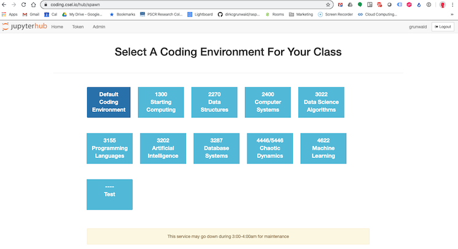

# Course Specific Containers
## Dept. of Computer Science, University of Colorado, Boulder

This repository provides the build files for course-specific containers for the ["coding environment"](https://coding.csel.io) in the Dept. of Computer Science at the University of Colorado.

That environment is set up to allow course-specific containers. We have a modified "spawn" page that lists all the available containers:

We do not currently customize the spawn page per user. All of the containers use the same organization and the same file system provided by an external NFS server, so there's little harm or complication in allowing students to use containers for courses in which they are not enrolled.

## Organization

We used to have a single notebook defined in `Dockerfile`. This is based on the [Docker Stacks jupyter/datascience-notebook](https://github.com/jupyter/docker-stacks) -- that container provides the basic Python, Jupyter and IPython environment based on Conda.

Different containers they customize the base container for specific classes. For example, `Dockerfile-db` provides the configuration for the database class (mysql libraries, xml, etc).

## Building

The build process is intended to be able to use a generalized project name for but now, it's hard-wired into the Makefile.

Run `make build` to build all the containers and `make push` to push them to the GCE container registry.

You can build specific containers using *e.g.* `make build-db` and `make push-db`.

Container version numbers are defined in the Makefile. Most of the contains based off the `latest` tag of the base container rather than a version-specific tag. This is obviously problematic for repeateable builds but hasn't caused (many) problems to date.

## Unusual Features

The primary unusual feature is that we provide Microsoft VScode in our base image. See `Dockerfile` for configuration details.